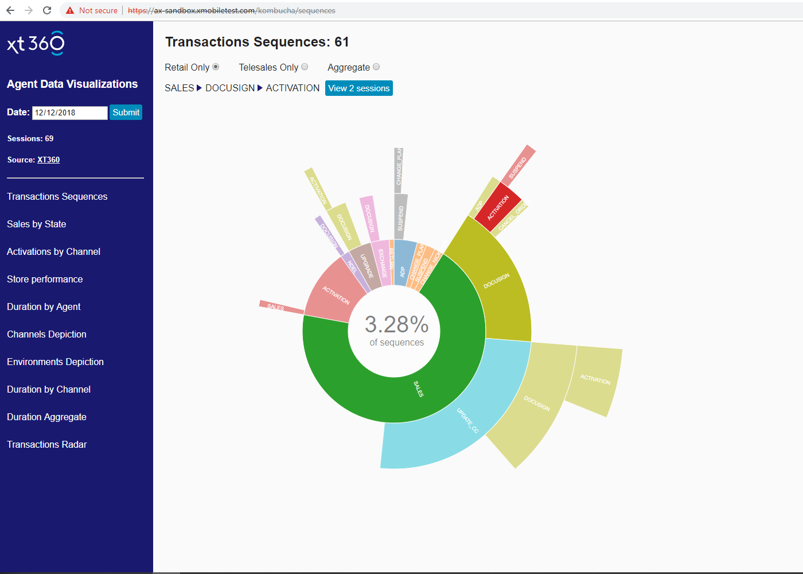

# Kombucha

This project  makes dev portal data https://retail.xmobiletest.com/xm-dev-portal/ visualization 

> It was generated with [Angular CLI](https://github.com/angular/angular-cli) version 6.0.8.




## Examples used

- http://bl.ocks.org


## Prerequisites

[Node.js and npm](https://nodejs.org/en/) 

> Verify that you are running at least node v6.x.x and npm 3.x.x by running node -v and npm -v in a terminal / console window. Older versions may produce errors.

## Steps

- Clone this repo into a new project folder.

 ```bash
 $ git clone git@github.comcast.com:XfinityMobile/XM360-kombucha.git
 $ cd XM360-kombucha
 ```

- Install the npm packages described in the `package.json`:

 ```bash
 $ npm install
 ```
 
- Run `ng serve` for a dev server.
- Navigate to `http://localhost:4200/`

If you want server to be available over the network use your IP

- Run `ng serve --host=10.36.124.122`  
- Go `http://10.36.124.122:4200`

#### nginx

`cp /home/lsavra472/nginx.conf /etc/nginx/nginx.conf`

#### Deploy prod (UNIX)
* get UNIX access using https://cada.comcast.net/
* if you are using Windows, install dos2unix `yum install dos2unix`
* pack files to  kombucha.zip on your machine (exclude node_nodules)
* for windows just run `zip.bat`
* connect to  10.36.124.122
* upload  kombucha.zip to /home/{user}/

_examples for user lsavra472_

`rm -rf /home/lsavra472/kombucha`

`unzip /home/lsavra472/kombucha.zip -d /home/lsavra472/kombucha`

`sudo -i`

`rsync -av /home/lsavra472/kombucha /var/www/kombucha`


---


### run  node app 

`/usr/local/bin/ng serve --host 0.0.0.0 --disable-host-check --base-href https://ax-sandbox.xmobiletest.com/kombucha/ &
`

####  stop node app

find pid and kill node process

` ps -ef | grep xmobiletest.com/kombucha`

> root     12864 23369  2 21:28 pts/0    00:00:32 ng serve --host 0.0.0.0 --disable-host-check --base-href https://ax-sandbox.xmobiletest.com/kombucha/

`kill -9 12864`

### run as a `kombucha.service` 


* do it once
* if you are using Windows, fix DOS  kombucha.service file

`dos2unix /home/lsavra472/kombucha/unix/kombucha.service`

copy kombucha.service file on server 

`cp /home/{user}/kombucha/unix/kombucha.service /etc/systemd/system/kombucha.service`

_example_

`cp /home/lsavra472/kombucha/unix/kombucha.service /etc/systemd/system/kombucha.service`


##### Tell systemd to start these when booting up
`sudo systemctl enable kombucha`

`sudo systemctl daemon-reload`

`sudo systemctl start kombucha`

##### Check status

`sudo systemctl status kombucha`

* Now you have Node service as a background service, it will be restarted when something goes wrong 
---

##### Run application

`systemctl restart kombucha`

##### View logs 

`sudo journalctl -u kombucha.service`

##### View logs real time 

`sudo journalctl -fu kombucha.service`
